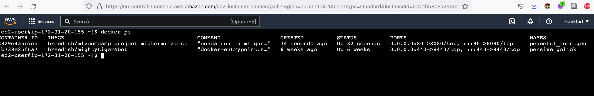
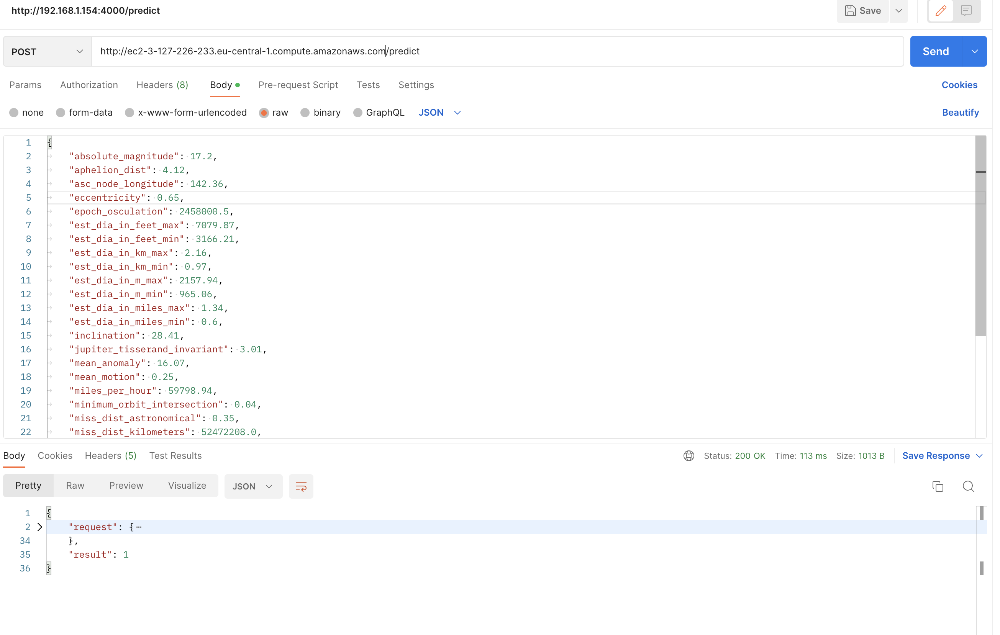

# Midterm project

# Project context

Since 1998, when NASA kicked off the biggest search for near-Earth asteroids, scientists have detected more than 25,000 of them. And 2020 turned out to be a record year for discoveries. Despite the pandemic interrupting many of the surveys, astronomers catalogued 2,958 previously unknown near-Earth asteroids over the course of the year (see ‘Space rocks’). All of these discoveries are making astronomers more conscious of the billiard-ball nature of the Solar System, where plenty of asteroids ping around in the space near Earth. 
In this project we are going to build a model to predict hazardous/non-hazardous asteroids in order to submit proper reaction on discovery(e.g. https://en.wikipedia.org/wiki/99942_Apophis)


# Dataset details
[https://www.kaggle.com/datasets/shrutimehta/nasa-asteroids-classification]
All the data is from the (http://neo.jpl.nasa.gov/). This API is maintained by SpaceRocks Team: David Greenfield, Arezu Sarvestani, Jason English and Peter Baunach.

# How to run

## _Localhost_

1. Install Conda - https://conda.io/projects/conda/en/latest/user-guide/install/index.html
2. Create Conda environment
```
conda env create -f ./conda-environment.yml
```
3. Activate Conda environment
```
conda activate ml
```
4. Train dataset
```
python train.py
```
5. Run prediction service, flask based
```
python predict.py
```
6. Execute requests
```
curl --location --request POST 'http://127.0.0.1:8080/predict' \
--header 'Content-Type: application/json' \
--header 'Cookie: t=5ilktgdpiuocks7uf667cvb841' \
--data-raw '{
	"absolute_magnitude": 17.2,
	"aphelion_dist": 4.12,
	"asc_node_longitude": 142.36,
	"eccentricity": 0.65,
	"epoch_osculation": 2458000.5,
	"est_dia_in_feet_max": 7079.87,
	"est_dia_in_feet_min": 3166.21,
	"est_dia_in_km_max": 2.16,
	"est_dia_in_km_min": 0.97,
	"est_dia_in_m_max": 2157.94,
	"est_dia_in_m_min": 965.06,
	"est_dia_in_miles_max": 1.34,
	"est_dia_in_miles_min": 0.6,
	"inclination": 28.41,
	"jupiter_tisserand_invariant": 3.01,
	"mean_anomaly": 16.07,
	"mean_motion": 0.25,
	"miles_per_hour": 59798.94,
	"minimum_orbit_intersection": 0.04,
	"miss_dist_astronomical": 0.35,
	"miss_dist_kilometers": 52472208.0,
	"miss_dist_lunar": 136.44,
	"miss_dist_miles": 32604718.0,
	"orbit_uncertainity": 0.0,
	"orbital_period": 1444.58,
	"perihelion_arg": 218.5,
	"perihelion_distance": 0.89,
	"perihelion_time": 2457936.02,
	"relative_velocity_km_per_hr": 96238.62,
	"relative_velocity_km_per_sec": 26.73,
	"semi_major_axis": 2.5
}'
```

Check for `result` property in response. Value of `1` means asteroid is hazardous, `0` not

## _In cloud_
```
curl --location --request POST 'http://ec2-3-127-226-233.eu-central-1.compute.amazonaws.com/predict' \
--header 'Content-Type: application/json' \
--data-raw '{
	"absolute_magnitude": 17.2,
	"aphelion_dist": 4.12,
	"asc_node_longitude": 142.36,
	"eccentricity": 0.65,
	"epoch_osculation": 2458000.5,
	"est_dia_in_feet_max": 7079.87,
	"est_dia_in_feet_min": 3166.21,
	"est_dia_in_km_max": 2.16,
	"est_dia_in_km_min": 0.97,
	"est_dia_in_m_max": 2157.94,
	"est_dia_in_m_min": 965.06,
	"est_dia_in_miles_max": 1.34,
	"est_dia_in_miles_min": 0.6,
	"inclination": 28.41,
	"jupiter_tisserand_invariant": 3.01,
	"mean_anomaly": 16.07,
	"mean_motion": 0.25,
	"miles_per_hour": 59798.94,
	"minimum_orbit_intersection": 0.04,
	"miss_dist_astronomical": 0.35,
	"miss_dist_kilometers": 52472208.0,
	"miss_dist_lunar": 136.44,
	"miss_dist_miles": 32604718.0,
	"orbit_uncertainity": 0.0,
	"orbital_period": 1444.58,
	"perihelion_arg": 218.5,
	"perihelion_distance": 0.89,
	"perihelion_time": 2457936.02,
	"relative_velocity_km_per_hr": 96238.62,
	"relative_velocity_km_per_sec": 26.73,
	"semi_major_axis": 2.5
}'
```


